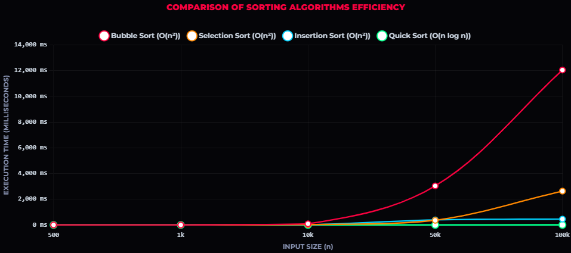
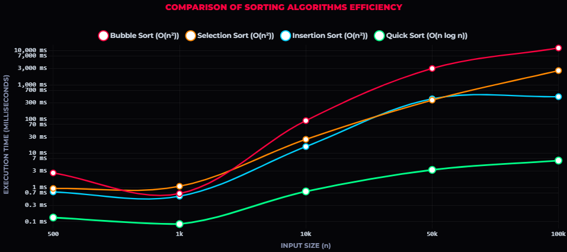

# Sorting Algorithm Benchmark & Efficiency Analysis
## โครงงานทดสอบและเปรียบเทียบประสิทธิภาพของอัลกอริทึมการเรียงลำดับ

> **วิชา:** ENGSE216 Data Structures and Algorithms  
> **ภาษาที่ใช้พัฒนา:** Java  

โปรเจกต์นี้เป็นการทดสอบวัดประสิทธิภาพเชิงประจักษ์ (Empirical Execution Time) ของอัลกอริทึมการเรียงลำดับข้อมูล (Sorting Algorithms) 4 ชนิด ได้แก่ **Bubble Sort**, **Selection Sort**, **Insertion Sort** และ **Quick Sort (Hoare's Partition)** โดยทำการสุ่มข้อมูลจำนวนเต็ม ($0 \dots n-1$) ที่ขนาด $n$ ต่างๆ กันตั้งแต่ **500, 1,000, 10,000, 50,000 จนถึง 100,000 ตัว** และนำผลเวลาที่ได้มาพล็อตกราฟเปรียบเทียบอัตราการเติบโตของเวลาตามทฤษฎี Big-O

---

## 1. Algorithms & Theoretical Complexity (ทฤษฎีความซับซ้อน)

ตารางเปรียบเทียบเทคนิคการออกแบบ (Design Technique) และความซับซ้อนตามหนังสือ *Introduction to the Design and Analysis of Algorithms* โดย Anany Levitin:

| Algorithm | Design Technique (กลวิธีออกแบบ) | 
| :--- | :--- | 
| **Bubble Sort** | Brute Force |
| **Selection Sort** | Brute Force | 
| **Insertion Sort** | Decrease-and-Conquer | 
| **Quick Sort** | Divide-and-Conquer | 

### สรุปแนวคิดของแต่ละ Algorithm:
* **Bubble Sort & Selection Sort (Brute Force):** เน้นวิธีคิดตรงไปตรงมา ตรวจสอบเปรียบเทียบและสลับที่ซ้อนกัน 2 ลูป ทำให้เวลาเติบโตเป็นกำลังสอง ($n^2$)
* **Insertion Sort (Decrease-and-Conquer):** ค่อยๆ แทรกข้อมูลเข้าสู่ส่วนที่เรียงแล้ว แม้เป็น $O(n^2)$ แต่ในทางปฏิบัติจะเร็วกว่า Bubble และ Selection อย่างชัดเจน
* **Quick Sort (Divide-and-Conquer):** ใช้ **Hoare's Partitioning** ในการเลือก Pivot เพื่อแบ่งข้อมูลซ้าย-ขวาอย่างรวดเร็ว ส่งผลให้เวลาเฉลี่ยอยู่ที่ $O(n \log n)$ ซึ่งมีประสิทธิภาพสูงสุด

---

## 2. Empirical Benchmark Results (ผลการทดสอบจริงจากเครื่อง)

วัดเวลาการทำงานด้วย `System.nanoTime()` ในหน่วย **มิลลิวินาที (Milliseconds: ms)** โดยแต่ละ Algorithm จะได้รับสำเนาชุดข้อมูลสุ่ม (`.getCopy()`) ที่เหมือนกันเป๊ะในแต่ละรอบ:

| ขนาดข้อมูล ($n$) | Bubble Sort (ms) | Selection Sort (ms) | Insertion Sort (ms) | Quick Sort (ms) |
| :---: | :---: | :---: | :---: | :---: |
| **500** | 2.451 | 1.141 | 1.231 | **0.251** |
| **1,000** | 0.741 | 1.536 | 1.132 | **0.147** |
| **10,000** | 106.781 | 40.879 | 19.980 | **1.241** |
| **50,000** | 3,276.934 | 578.589 | 389.524 | **3.074** |
| **100,000** | **13,969.114** (~14 วินาที) | 4,338.790 (~4.3 วินาที) | 495.174 (~0.5 วินาที) | **6.139** (0.006 วินาที!) |

### บทวิเคราะห์ผลลัพธ์ (Key Insights):


1. **Quick Sort เร็วกว่ามหาศาล:** ที่ $n = 100,000$ Quick Sort ใช้เวลาเพียง **6.257 ms** ในขณะที่ Bubble Sort ใช้เวลาถึง **13,969 ms** คิดเป็นความเร็วที่ต่างกันมากกว่า **2,275.5 เท่า!**
2. **ลักษณะของเส้นกราฟ:**
   * กลุ่ม $O(n^2)$ (โดยเฉพาะ Bubble Sort) กราฟจะ **เชิดหัวชันขึ้นเป็นพาราโบลา** ตามที่อาจารย์วาดบนกระดาน
   * กลุ่ม $O(n \log n)$ (Quick Sort) กราฟจะ **เกือบเรียบติดแกนล่าง** แสดงถึงความเสถียรและประสิทธิภาพที่เหนือกว่าเมื่อข้อมูลมีขนาดใหญ่

---

## 3. Project Structure (โครงสร้างโปรเจกต์)

โปรเจกต์จัดโครงสร้างตามหลัก Clean Architecture และ Object-Oriented Programming (OOP):

```text
SortBenchmark/
├── src/                          # โค้ดภาษา Java ทั้งหมด
│   └── sortbenchmark/
│       ├── Algorithm.java        # อิมพลีเมนต์อัลกอริทึมทั้ง 4 ตัว
│       ├── GenerateData.java     # จัดการสุ่มและสำเนา Array (OOP Style ปลอดภัยด้วย getCopy())
│       ├── TimeTracker.java      # คลาสจับเวลาความละเอียดสูงระดับนาโนวินาที
│       └── SortBenchmark.java    # คลาสหลัก (Main) รันการทดสอบและพิมพ์ตารางผลลัพธ์
│
├── web/                          # แดชบอร์ดแสดงผลกราฟสไตล์ SpaceX x PewDiePie
│   ├── index.html                # หน้าแดชบอร์ดหลัก (พร้อม Starfield Canvas และ Telemetry HUD)
│   ├── chart.html                # หน้ากราฟเดี่ยว
│   ├── style.css                 # สไตล์ชีทตกแต่งธีม PewDiePie Cyber Neon
│   └── pewdiepie_brofist.png     # รูปภาพโลโก้ Header
│
├── chart.html                    # ทางลัดสำหรับดับเบิ้ลคลิกเปิด Dashboard ทันที
├── build.xml & manifest.mf       # ไฟล์คอนฟิกของ NetBeans Ant
├── .gitignore                    # กฎการคัดกรองไฟล์ Git เพื่อไม่ให้ไฟล์ Compile ชั่วคราวปนใน Repo
└── README.md                     # เอกสารอธิบายโครงงานฉบับสมบูรณ์
```

---

## 4. How to Run (วิธีรันโปรแกรม)

### รันผ่าน NetBeans IDE:
1. เปิดโปรเจกต์ใน **NetBeans IDE**
2. คลิกขวาที่โปรเจกต์ $\rightarrow$ เลือก **Run** (หรือกดปุ่ม `F6`)
3. ดูผลลัพธ์ตารางเวลาที่จะพิมพ์ออกมาทีละแถวในหน้าต่าง Output

### รันผ่าน Terminal / Command Line:
```bash
# คอมไพล์โค้ด Java
javac -d build/classes src/sortbenchmark/*.java

# สั่งรันโปรแกรม Benchmark
java -cp build/classes sortbenchmark.SortBenchmark
```

### วิธีเปิดดูแดชบอร์ดกราฟ (Interactive Dashboard):
* ดับเบิ้ลคลิกที่ไฟล์ **[`chart.html`](chart.html)** หรือเปิด **[`web/index.html`](web/index.html)** ด้วย Browser (Google Chrome, Microsoft Edge)